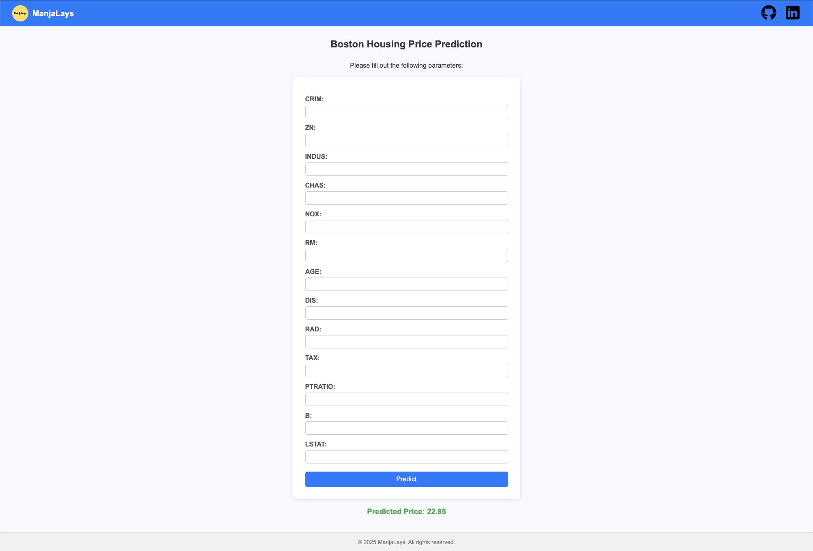

# 🏠 Boston Housing Price Prediction

This is a web application that predicts Boston house prices based on various input features. It uses a Machine Learning model trained on the Boston Housing dataset and is served via a Flask backend.

👉 **Live Demo:** [https://boston-house-price-prediction-khek.onrender.com/predict](https://boston-house-price-prediction-khek.onrender.com/predict)

---

## 📌 Features

- 🔍 Predict house prices using 13 input parameters
- 🧠 Machine Learning model (Linear Regression)
- 🌐 Flask-powered backend
- 🎨 Clean and responsive frontend with HTML & CSS
- ☁️ Hosted on [Render](https://render.com)

---

## 🚀 Technologies Used

- Python
- Flask
- Scikit-learn
- NumPy
- HTML/CSS
- Render (for deployment)

---

## 🧠 Model Details

- Dataset: **Boston Housing Dataset**
- Algorithm: **Linear Regression**
- The model was trained locally, serialized with `pickle`, and loaded in the Flask backend to generate predictions based on form inputs.

---

## 🖼️ Screenshots

  

---

## 📁 Project Structure
```
MLProject/
├── app.py                      # Main Flask application
├── house_price_prediction.pkl  # Serialized ML model
├── requirements.txt            # Python dependencies
├── templates/
│   └── index.html              # Main HTML page
└── README.md                   # Project documentation
```
---

## 🧑‍💻 Author

Saanthanu Prasad
	•	[GitHub](https://github.com/ManjaLays)
	•	[LinkedIn](https://www.linkedin.com/in/its-saanthanu-prasad/)

---

## 📄 License

This project is open-source and free to use for educational and non-commercial purposes.
